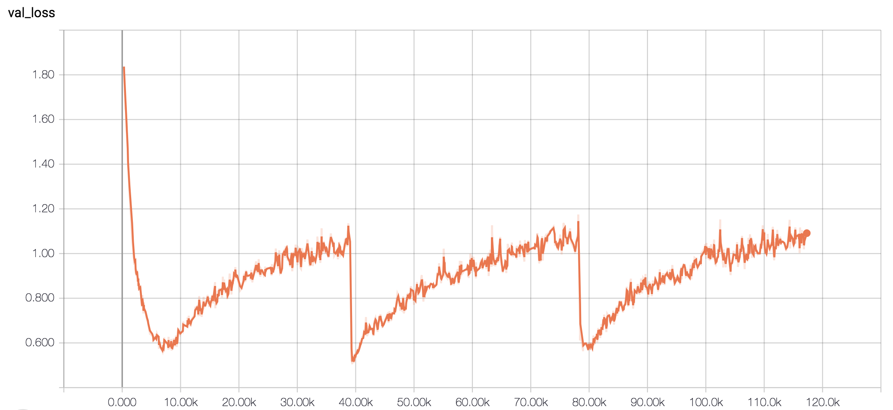

# Born-Again Neural Networks
[](https://opensource.org/licenses/MIT)


Unofficial pytorch implementation of Born-Again Neural Networks.

* link: http://proceedings.mlr.press/v80/furlanello18a/furlanello18a.pdf

> Knowledge Distillation (KD) consists of transferring
“knowledge” from one machine learning
model (the teacher) to another (the student).
Commonly, the teacher is a high-capacity model
with formidable performance, while the student
is more compact. By transferring knowledge,
one hopes to benefit from the student’s compactness,
without sacrificing too much performance.
We study KD from a new perspective:
rather than compressing models, we train students
parameterized identically to their teachers.

## Examples
* dataset: cifar-10
* base model: ResNet-50




## Training
```bash
$ python train.py --h
usage: train.py [-h] [--weight WEIGHT] [--lr LR] [--n_epoch N_EPOCH]
                [--batch_size BATCH_SIZE] [--n_gen N_GEN]
                [--resume_gen RESUME_GEN] [--dataset DATASET]
                [--outdir OUTDIR] [--print_interval PRINT_INTERVAL]

optional arguments:
  -h, --help            show this help message and exit
  --weight WEIGHT
  --lr LR
  --n_epoch N_EPOCH
  --batch_size BATCH_SIZE
  --n_gen N_GEN
  --resume_gen RESUME_GEN
  --dataset DATASET
  --outdir OUTDIR
  --print_interval PRINT_INTERVAL
```

## Inference

```bash
$ python infer.py --h
usage: infer.py [-h] [--weights_root WEIGHTS_ROOT]

optional arguments:
  -h, --help            show this help message and exit
  --weights_root WEIGHTS_ROOT
```

## References
* Furlanello, T., Lipton, Z., Tschannen, M., Itti, L.&Anandkumar, A.. (2018). Born-Again Neural Networks.Proceedings of the 35th International Conference on Machine Learning, in PMLR80:1602-1611
* Hinton, Geoffrey, Oriol Vinyals, and Jeff Dean. "Distilling the knowledge in a neural network." arXiv preprint arXiv:1503.02531 (2015).

## LICENSE
This repository is MIT-style licensed, as found in the [LICENSE file](./LICENSE).

## Citation

```bibtex
@software{https://doi.org/10.5281/zenodo.4405020,
  doi = {10.5281/ZENODO.4405020},
  url = {https://zenodo.org/record/4405020},
  author = {Masanari Kimura},
  title = {PyTorch Born Again Neural Networks},
  publisher = {Zenodo},
  year = {2020},
  copyright = {Open Access}
}
```
